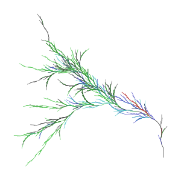
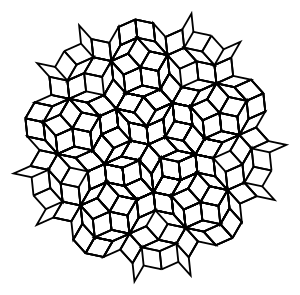
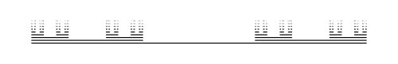
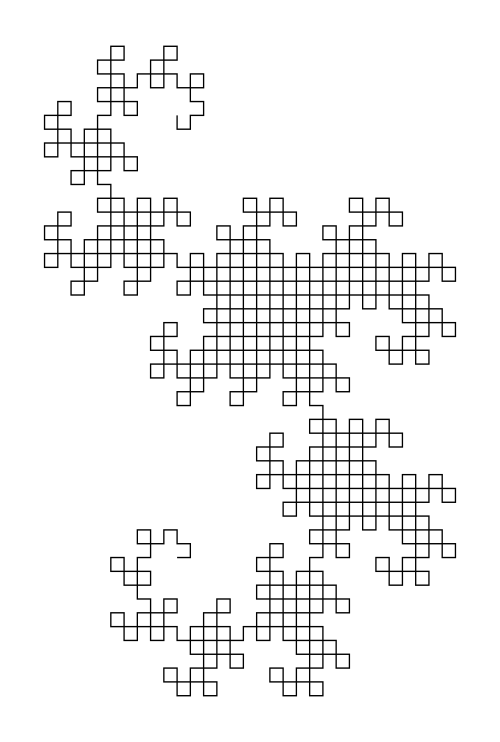
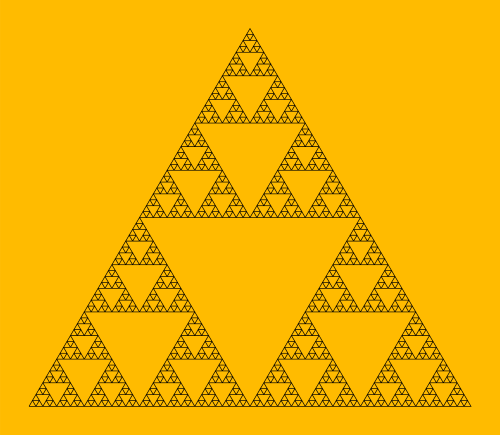

# Extended L System Generator

This project implements an interpreter in C++ of L-Systems descriptor files (`*.lsd`) writen in a custom specific purpose language LSysDescriptor, LSysD or just LSD (see `Syntax and semantics`).

The project is able to generate L-Systems after its axiom and rules, print the result or generate a 2D image of it (see `2D Display interpretation`).

An L-System has a set of rules and an axiom, that changes every character on each iteration if a rule is found for each of them. You should also specify the number of iterations (default is 0, prints axiom).

## Examples (generated with the program)



Some parametric random plant (B2.lsd, 20 iterations)



Penrose tiling (PenroseTiling.lsd, 4 iterations)



Cantor set (ParametricCantorSet.lsd, 8 iterations)



Dragon curve (Dragon.lsd, 10 iterations)

## The program

### Compilation

#### Ubuntu/Debian

This program uses Boost libraries. To install boost:

```
sudo apt install libboost1.67-dev
```

Then, in LSysGen folder, run:

```
mkdir build && cd build
cmake ..
make
```

If everything goes well, you will get the shared library `lsysgen.so` (that contains all the functionality of the project), the executable `lsys` that prints the generated string in the standard output, `lsys2svg` that prints and SVG image of the L system and, only if OpenGL and GLUT libraries are found in your system, `lsys2d` that shows a 2D representation of the generated output in a new window.

(*Optional*) If you wish to re-build the lexer and parser files from the grammars (`*.g4`), run (in the project root directory):

```
java -jar <ANTLR4-JAR> -Dlanguage=Cpp -o antlr4-generated/ LSysDParser.g4 LSysDLexer.g4 -visitor -no-listener
```

where `<ANTLR4-JAR>` is a jar file that contains the ANTLR 4 parser generator. Or, if you have ANTLR 4 installed and accessible:

```
antlr4 -Dlanguage=Cpp -o antlr4-generated/ LSysDParser.g4 LSysDLexer.g4 -visitor -no-listener
```

### Execution

There are two executables in this project: `lsys` and `lsys2d`. They work with the same inputs, but `lsys` prints the result and `lsys2d` shows a 2D representation of the result in a new window.

There is also a Python module, `lsys.py`, that fetches the generated shared library and serves as a Python wrapper of the library (through its class `LSystem` that is able to print the L system and also its SVG representation).

To execute any of the above mentioned programs, go to `build/` and run either of:

```
./lsys FILE [N_ITERATIONS]
./lsys2svg FILE [N_ITERATIONS]
./lsys2d FILE [N_ITERATIONS]
```

The python script is also runnable and prints the resulting L system string and the SVG image:

```
./lsys.py FILE [N_ITERATIONS]
python lsys.py FILE [N_ITERATIONS]
```

`FILE` is a file `*.lsd` (or `-` for standard input) that describes an L-system. The next part of this file will show you how to edit a `*.lsd` file, and `N_ITERATIONS` is the number of iterations of the algorithm. If absent, the one defined in `FILE` will be used instead. Examples:

```
echo "set axiom='a';a->b;b->ab;" | ./lsys - 12
echo "set axiom='a';set iterations=12;a->b;b->ab;" | ./lsys -
./lsys ../examples/b2.lsd 20
```

<!--There are some useful options that you can see with the help:

$ python3 lsys\.py \-h

By default, the program will interpret the L-System and will draw it in a new window.-->

## Example L systems

Example `*.lsd` files are provided in `examples/`. You just have to execute the program with the name of the file as its parameter, and optionally a number of iterations.

## Syntax and semantics

### Document structure

To define an L system with an axiom and the rules that transform it, I have created the LSD (L System Descriptor) specific purpose language.

In the cases where we want to define just an axiom for the program to interpret it, we can just fill the document with the axiom. For example, to quickly draw a custom figure:

```
echo "n(255,0,0)F+F+PF+F+F+Fp+F+F" | ./build/lsys2d - > images/test.svg
```

But this is not the main case. If we want to *generate* the L system, we create an LSD document for it.

The LSD document consists on a series of definitions inside a name:

```
lsystem Name {

    # definitions...

}
```

or anonymous, without any name:

```
# definitions...
```

The three most important definitions in an L system are the **axiom**, the **rules** and the **number of iterations** (they are explained in further subsections).

For example, the sierpinski triangle in `examples/sierpinski.lsd`:

```
lsystem SierpinskiTriangle {

    axiom F-G-G

    set iterations = 6
    set initial_heading = 0
    set rotation = -120
    set background = "#ffbb00"

    rules {
        F -> F-G+F+G-F
        G -> GG

        G => F
    }

}
```

If we run:

```
./build/lsys2svg examples/SierpinskiTriangle.lsd > images/SierpinskiTriangle-6.svg
```

This generates:



An example of an anonymous L system:

```
echo "axiom A; A->B; B->AB" | ./build/lsys - 5
```

This gives us `BABABBAB`.

### Comments

Every line followed by the character `#` is a comment and will be ignored by the interpreter:

```
# Hey I'm a comment
set notAComment = 3 #aComment
```

### Axiom

The axiom of an L system is the initial string and must be always defined once for each L system. This string is changed by the rules in the first iteration. The result of that is changed again by the rules in the second iteration... and so on.

We define an axiom:

```
axiom AB;
```

Semicolons at the end of each definition are only required if you wish to write several definitions in the same line.

### Number of iterations

This is the number of times that rules will be applied to generate the L system. We just have to define the property `iterations` as a non-negative integer:

```
set iterations = 6
```

### Production rules

Production rules have the syntax:

```
[tag:] [(weight)] [left_context<] char [>right_context] -> replacement
```

Production rules can be inside `table` blocks, `rules` blocks, `production rules` blocks or outside any block:

```
rules {
    v -> avd  # Valid
    r -> rr   # Valid
}
a -> aFa      # Valid
production rules {
    k -> F-F  # Valid
}
```

A DOL system (the most basic one) has rules of type:

```
char -> replacement
```

where the `char` occurrences are replaced by `replacement` in each iteration.
A DIL system (context-sensitive) would have rules with a left context:

```
left_context < char -> replacement
```

a right context:

```
char > right_context -> replacement
```

both:

```
left_context < char > right_context -> replacement
```

or none (like DOL's rules).
A probabilistic l-system may have more than one rule available for the same character. Also, a weight can be specified for each rule (when the weight is not defined, a rule has a default weight of `1`). That weight will determine the probability of the rule to be chosen over other available rules. The syntax of a weighted rule just adds the parenthesized value at the beginning of the rule. For example:

```
(9) a -> a
    a -> b
(!) a < a -> ba
```

In this example, with an axiom `aaba`, the system would replace the first and last `a` characters by `a` (90% probability) or `b` (10% probability). The second 'a' would match the three rules, but only the third would be always applied, because the special weight `!` means that it must be always chosen.

As you can see, any pair of ambiguous rules can bring non determinism to our l-system, even without explicit set of weights. Also, when two rules with `!` weight are available for some character, the first one will be always applied.

For parametric l-systems, you can just add parameters to any character in the left or right. The char to be replaced can define its parameters' names and even define a condition (optional). The right side can specify arguments for its characters. For example:

```
a(x, y) -> b(x, y-1)
b(x, y | y >= 0) -> a(x+1, y)c(y)
```

Expressions in the right side or condition can use parameters of that rule, global constants and a special variable `i` that equals the number of the current iterations (`0` in axiom, `1` in first iteration, `2` in second, etc.)

Any character in the left and right contexts can also define their parameter names and their conditions. Char's condition can reference both context sides' params, but contexts' conditions can only reference char's params and params defined before them. The right side of the rule can reference all the params defined in the left side of the rule. For example:

```
c(x)d(y|x==y and y<z) < a(z, w) > d(y_|y_>z)c(x_|y_==x_) -> a(max(y, y_), w)
```

Bracketed IL-systems (context-sensitive l-systems with branches) have a special treatment for brackets. They are not treated as characters in the left side, so they cannot be replaced. When asking for a character in a left context:

```
a < b -> bb
```

The `b` of `abc` would be accepted, and also the one of `a[cc]b`, `a[bcd]` and `a[[b]c]`, but not `[a]b`.
For right context:

```
b > a -> c
```

The `b` of `cba` would be accepted, and also the one of `cb[cd]a`, `b[add]c` and `b[[a]d]`, but not `[b]a`.
When asking for a branch in the left or right context, it is matched if and only if a branch is found starting by the specified elements (at the beginning, on the left). For example:

```
[ab] < c > [ad] -> [cab]
```

matches with the `c` in `[abddd]c[adrst]`, `[ab]c[ad]`, `[ab][c[[ad]s]]`, but not `[ba]c[ad]` or `[dab]c[ssad]`.

A rule can have in the left hand side the special character `_` that represents any character. For example:

```
    a -> bd
    b -> ac
(!) a < _ > a -> a
```

means that any character surrounded by `a`s will always be replaced by an `a`. This one:

```
b_c < a -> o
```

matches the `a` of `baca`, `b+ca`, `bbca`, etc.

### Tables

If you plan to use tables, you need to write the line:

```
set table_func(i) = <expr>
```

where `<expr>` is the expression of the function that decides which table will be used for the `i`-th iteration. For example:

```
set table_func(i) =  if i % 5 != 1 then "t1" else "t2"
```

Table names cannot be numbers. The code that defines a table is:

```
table <name> { <rules> }
```

Inside `table` blocks you can define rules or reference tags of already defined rules. For example:

```
set table_func(i) = 't' + str(i % 2)
rules {
    rep: (!) aa < a -> aFb
}
table t0 {
    a -> b
    b -> ab
    rep
}
table t1 {
    a -> ba
    b -> a
    rep
}
```

### Coding rules

Coding rules can also be specified (better after production rules). These special rules are not applied as production rules. Instead, they apply at the end of an iteration for the string to be interpreted. For example, if you want the character `R` to be interpreted as a right branch (`[-F]`), you must not add a production rule for it, because it would not work with the `R`s generated in the same iteration and you would not be able to replace that `R` anymore (instead, you would end accumulating `[-F]`s everywhere). What you would need is:

```
R => [-F]
```

With this rule, the string `FFRFFR` would feed the next iteration but for the graphic representation it would be transformed into `FF[-F]FF[-F]`.

Coding rules can be included inside `rules` block, `coding rules` block or outside any block:

```
a => FFF      # Valid
a -> aFa      # Valid
rules {
    v -> avd  # Valid
    v =>      # Valid
}
coding rules {
    r -> rr   # Invalid
    r => k    # Valid
}
production rules {
    k => F-F  # Invalid
    k -> F-F  # Valid
}
u => [+F]     # Valid
```
    
The syntax of the coding rules is the same than production rules', but using double arrow (`=>`). They also work similarly. Note that coding rules don't belong to tables, but they are global.

### Properties

We have seen the `iterations` property and the `table_func` function to choose which table to choose each iteration. We can define any property. These are predefined properties used by the L system generator:

```
set iterations = 8          # (defaults 0) This line sets the number of iterations that the system will be executing
set ignore = ""             # (optional, defaults "") This property sets the characters that must be ignored as context (see contexts in rules)
```

And these are the properties used by the 2D interpreter:

```
set initial_heading = 90    # (optional, defaults 0) This property sets the initial heading in degrees that the turtle will have. 0 heads east. 90 heads north
set rotation = 30           # (optional, defaults 12) This property sets the angle rotation in degrees that is used in rotations (- and + chars)
set line_width = 0.02       # (optional, defaults 0.1) This property sets the line width of F and G draw characters, relative to the line length (0.02 is a line width of 0.02 per 1 pixel of line length, so if the line is 100px long, its width will be 2px)
set background = "#FFBB00"  # (optional, defaults "transparent") This property sets the background color of the SVG
```

You can also define any other property you want, and use them in the expressions of parametric rules.

## 2D Display interpretation

The program `lsys2d` draws vector graphics after the resulting string and `lsys2svg` creates an SVG image file from the same result (without opening a window).

The special characters that 2D interpretation uses are:

- `F` draws a forward line.
- `G` draws a backward line.
- `f` moves forward without drawing.
- `g` moves backward without drawing.

`F`, `G`, `f` and `g` can have one parameter that specifies the length of the line/move. Default is `1.0`.

- `+` rotates counterclockwise.
- `-` rotates clockwise.

`+` and `-` can accept one parameter that specifies the rotation angle (in degrees). Default angle is defined by the user in the property `rotation`.

- `[` pushes a state / creates a branch.
- `]` pops a state / closes the branch.

The state is a position, heading, color and line width configuration. When closing a bracket, the turtle returns to the state when the bracket was opened.

- `c(r, g, b)` or `c(r, g, b, a)` changes the pen and fill color to the specified by the parameter(s) (`r` for red, `g` for green, `b` for blue and `a` for opacity; colors and opacity values range from 0 to 255 or from 0.0 to 1.0) until the end of the current branch or until it is changed again. For example, `c(255, 0, 0)` sets color to red (opaque by default), `c(80, 80, 80, 0.5)` sets color to semi-transparent dark grey and `c(1.0, 0.0, 1.0, 1.0)` sets color to opaque pink. Default fill and pen color is black.
- `n` works as `c` but only with pen color.
- `l` works as `c` but only with fill color.

- `w()` or `w(wid)` changes the line width of the following lines to `wid` or to the value of the property `line_width` by default.
`w(wid)` works as the property `line_width` but it affects anly the following lines instead of being global.

Color and line width changes won't be visible while filling, so they are not recommended under filling.

- `P` to start delimiting a figure to fill. `P(r, g, b)` and `P(r, g, b, a)` is also valid and works as l but just for the current fill.
- `p` to end delimiting the figure.

It is not possible to fill two figures if one contains another in the string. This is, every `P` must be followed by a `p` before branch end or another `P`, and there must not be a `p` without a `P` before. They work in the same branch, not in children nor in parent, and if you start a branch while filling, the new branch won't be filled.

- `Z` to close the current path.
Paths are continuous until a color or line width change or a `P`, `p` or `Z` is found.

- `c`, `c()` and `c(r)` draws a circle of centre the current position and of radius `r` or `1.0` by default. This command does not end the current path.

- `q` starts a quadratic bezier curve. It uses the next two points to define the curve, ending in the second one.
- `t` works as `q` but is always defined just after `q` and uses its last point for the first point, so `t` only requires to define one point.
- `z` starts a cubic bezier curve. It uses the next three points to define the curve, ending in the third one.
- `s` works as `z` but is always defined just after `z` and uses its last point for the first point, so `s` only requires to define two points.

The rest of the characters will be ignored when displaying.

## SVG

`lsys2svg` converts the L-system to SVG. If you want to convert the image later to PNG, for example, in linux you can use inkscape:

```
inkscape -o test.png -w 1000 -b white test.svg
```

## Next steps

- Manage pointers (destructors and deletes)
- Get rid of boost dependency?
- Capture all LSD semantic errors and expression evaluation errors
- Debug
- Compile in windows?
- Run in a web page
- 3D representation and model export?
- Music representation?
- Optimize expressions (getting rid of strings and transforming trivial expressions into values)

