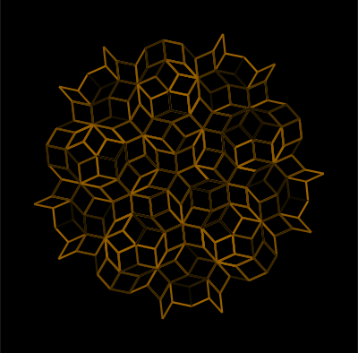
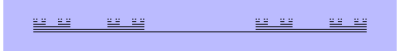

# Extended L System Generator

This project implements in C++ an L System generator and renderer and a LSDL (L System Defining Language) interpreter. LSDL is a custom specific purpose language (see `Syntax and semantics`) that has been created ad-hoc for this project as a way of describing L Systems to the generator. The program reads LSDL `*.lsd` files, that define one or more L Systems with an easy and compact syntax. You can not only print the results of the L System but also create a SVG image from it (see `2D rendering`). Example:

```
lsys -a "A" -r "A->F(1.0)[+A][-A]; F(x)->F(x*1.6)" -H 90 -R 60 -C "#f00" -W 2 -i 11 -o svg -w 1000 | display
```

Shows:


An L system or Lindenmayer system is a parallel rewriting system and a type of formal grammar. An L-system consists of an alphabet of symbols that can be used to make strings, a collection of production rules that expand each symbol into some larger string of symbols, an initial "axiom" string from which to begin construction, and a mechanism for translating the generated strings into geometric structures.

L-systems were introduced and developed in 1968 by Aristid Lindenmayer, a Hungarian theoretical biologist and botanist at the University of Utrecht. Lindenmayer used L-systems to describe the behaviour of plant cells and to model the growth processes of plant development. L-systems have also been used to model the morphology of a variety of organisms and can be used to generate self-similar fractals.

To create an L System an axiom and a set of rules are needed (you can build an L System with just an axiom too, although it wouldn't change over iterations). An axiom is a string of characters such as letters, numbers and some symbols, e.g. "A", "F++F++F", etc. A rule has generally the shape "left -> right", where 'left' is the character the rule will select to be replaced by the 'right' string, e.g. "A -> AB", "B->A", etc.

Enjoy creating plants and fractals with this tool!

<!--The project is able to generate L-Systems after its axiom and rules, print the result or generate a 2D image SVG of it (see `2D rendering`).

An L-System has a set of rules and an axiom, that changes every character on each iteration if a rule is found for each of them. You should also specify the number of iterations (default is 0, prints axiom).-->

## Documentation

LSysGen source code documentation (auto generated by Doxygen):

- https://acs2405.github.io/LSysGen

## Example L Systems (generated with the program)

Example `*.lsd` files are provided in `examples/`. You are free to use them in the program, even tweaking some parameters (see `lsys --help`).

```
lsystem DragonCurve {

    axiom FX

    set iterations = 10
    set initial_heading = 0
    set background = "#000"
    set line_color = "#3f3"
    set rotation = 90

    rules {

        X -> X+YF+
        Y -> -FX-Y

    }

}
```

Executing the program with this file (`lsys examples/Dragon.lsd -o svg | display`) generates:


### Other examples

Some parametric random plant (examples/B2.lsd):


Penrose tiling (examples/Penrose.lsd):



Broccoli (examples/Broccoli.lsd):


Cantor set (examples/ParametricCantorSet.lsd):



## The program

### Build

#### Ubuntu/Debian

This program uses `ANTLR 4.12.0` and `CMake (>=3.16)`. ANTLR4 will later be installed and linked with the `make` command automatically. `imagemagick` is not needed for the program tobuild or run, it justs provides the `display` command to be able to easily display SVG outputs in the command line (e.g. `./lsys (...) -o svg | display`). To install our dependencies:

```
sudo apt install g++ cmake imagemagick
```

If you want to modify grammar files, you will need `Java 11` for `make` to generate C++ outputs automatically with the ANTLR jar file. In this case, also run:

```
sudo apt install default-jre
```

Then, in our `LSysGen` folder, run:

```
mkdir build && cd build
cmake ..
make
```

We have just created a `build` folder and built the program in it (our executable is `build/lsys`).

For debug purposes, the cmake command should be:

```
cmake -DCMAKE_BUILD_TYPE=Debug ..
```

If everything goes well, you will get the library `lsysgen.a` (that contains all the functionality of the project) and the executable `lsys`, the main program. Type `./lsys --help` for information about usage and arguments.

No other Linux distributions have been tested yet for this project.

<!--
(*Optional*) If you wish to re-build the lexer and parser files from the grammars (`*.g4`), run (in the project root directory):

```
sudo apt install default-jre
```

```
java -jar <ANTLR4-JAR> -Dlanguage=Cpp -o antlr4-generated/ LSysDParser.g4 LSysDLexer.g4 -visitor -no-listener
```

where `<ANTLR4-JAR>` is a jar file that contains the ANTLR 4 parser generator. Or, if you have ANTLR 4 installed and accessible:

```
antlr4 -Dlanguage=Cpp -o antlr4-generated/ LSysDParser.g4 LSysDLexer.g4 -visitor -no-listener
```
-->

#### MacOS

MacOS target is expected to be tested in the future (but it should work fine with CMake and XCode/CLang++).

#### Windows

You can compile the project in Windows with CMake GUI (which generates the Visual Studio project) and Visual Studio 2017+ (which builds the project; has some known issues).

#### Cross-compiling from Linux

You can cross-compile Windows binaries from Linux using MinGW:

```
sudo apt install mingw-w64
```

And compiling it the same way than the Linux section, but adding an extra argument to the `cmake` command:

```
mkdir -p build/win32 && cd build/win32
cmake -DCMAKE_TOOLCHAIN_FILE=cmake/i686-w64-mingw32.cmake ..
make
```

The second line builds a 32-bit Windows executable file. If you want a 64-bit executable instead, change `-DCMAKE_TOOLCHAIN_FILE` argument value to `cmake/x86_64-w64-mingw32.cmake`.

This commands will create a `build/win32` folder and will generate our executable there (`build/win32/lsys.exe`) that will work in any Intel/AMD (32/64-bit) Windows machine.

### Make documentation

#### Ubuntu/Debian

Documentation about the code of this project is automatically deployed with `make doxygen`, where `doxygen` is the tool we are using to generate out docs:

```
sudo apt install doxygen
mkdir -p build
cd build
cmake ..         # if we didn't mkdir and cmake in the build process
make doxygen
```

This will create our documentation HTML files in `build/docs/doxygen/html`.

### Execution

This project has two elements for processing L Systems: an executable and a library. The library (`lsysgen`) provides access to functions to manage our L Systems, Modules and read LSDL files. The executable (`lsys`) provides many options to create, customize and run your L Systems with command line arguments. The `-o svg` option prints or writes to a file a SVG image of the run (the program just prints out the file, you can open it with a SVG compatible image viewer or a web browser, see `2D rendering`).

To execute the `lsys` program, go to `build/` and run either of:

```
./lsys INPUT_FILE... [OPTIONS]
./lsys -a AXIOM [OPTIONS]
```

The main options are:

- `-i N`: sets or overrides the number of iterations
- `-a AXIOM`: sets or overrides the axiom. `AXIOM` should be quoted.
- `-r RULES`: adds rules to the L System. `RULES` must be quoted.
- `-l NAME...`, `--all`: selects the L System(s) that will be displayed from the source file (when there are more than one in the same LSD file). `--all` selects all of them.
- `-o FORMAT [OUTPUT_FILE]`: outputs the result of the L System iterations as some `FORMAT`. If `OUTPUT_FILE` is set to a directory, a `FILE.EXT` will be created inside that directory for every L System that has been selected (replacing `FILE` by the name of the L System and `EXT` by the format extension). If `OUTPUT_FILE` is not set or set to `-`, the program will print the result in the standard output. The two currently supported formats are `raw` (raw text output) and `svg` (SVG representation of the result).

Run `./lsys --help` to see all options. 

Examples:

Inline L System (without LSDL file, defined by axiom (`-a`) and rules (`-r`) arguments):

```
./lsys -a "A" -r "A->B; B->AB;" -i 10
```

Output:

```
ABBABBABABBABBABABBABABBABBABABBABBABABBABABBABBABABBABABBABBABABBABBABABBABABBABBABABBAB
```

L System from LSDL file (ImageMagick's `display` opens a window that displays the SVG image output):

```
./lsys ../examples/tests.lsd -l Test1 -o svg - | display
```

Output:


Other examples:

```
./lsys ../examples/Hilbert.lsd -o svg -i 4 | display
./lsys ../examples/B2.lsd -i 20 -o svg B2-20.svg
./lsys ../examples/classics.lsd --all -o svg ../images
```

There is also a small Python module, `lsys.py`, that uses the `lsysgen` library and serves as a Python wrapper for the library (through its class `LSystem` that is able to print the L system and also its 2D render). This python script is also runnable and prints the resulting L system string and the SVG image:

```
python lsys.py INPUT_FILE [N_ITERATIONS]
```

<!--

`INPUT_FILE` is a `*.lsd` file (or `-` for standard input) that defines an L-system. The next part of this file will show you how to edit a `*.lsd` file.

There are some useful options that you can see with the help:

$ python3 lsys\.py \-h

By default, the program will interpret the L-System and will draw it in a new window.-->

## LSDL Syntax and semantics

### Document structure

To define an L system with an axiom and the rules that transform it, I have created the LSDL (L System Defining Language) specific purpose language.

In the cases where we want to define just an axiom for the program to interpret it, we can just fill the document with the axiom. For example, to quickly draw a custom figure:

```
./build/lsys -a "F+F+PF+F+F+Fp+F+F" -F "#FF0000" -R 30 -o svg images/test.svg
```

But this is not the main case. If we want to *generate* the L system, we create an LSDL document for it or tweak the program's parameters (`-r` to add rules, etc.).

The LSDL document consists on a series of definitions inside a name:

```
lsystem Name {

    # definitions...

}
```

or anonymous, without any name:

```
# definitions...
```

The three most important definitions in an L system are the **axiom**, the **rules** and the **number of iterations** (they are explained in further subsections).

For example, the sierpinski triangle in `examples/sierpinski.lsd`:

```
lsystem SierpinskiTriangle {

    axiom F-G-G

    set iterations = 6
    set initial_heading = 0
    set rotation = -120
    set background = "#ffbb00"

    rules {
        F -> F-G+F+G-F
        G -> GG

        G => F
    }

}
```

If we run:

```
./build/lsys examples/Sierpinski.lsd -l SierpinskiTriangle -o svg - | display
```

This generates:


An example of an anonymous L system:

```
./build/lsys -a "A" -r "A->B; B->AB" -i 5
```

This gives us `BABABBAB`.

### Comments

Every text (in a line) followed by the character `#` is a comment and will be ignored by the interpreter:

```
# Hey I'm a comment
set notAComment = 3 #aComment
```

### Axiom

The axiom of an L system is the initial string and must be always defined once for each L system. This string is changed by the rules in the first iteration. The result of that is changed again by the rules in the second iteration... and so on.

We define an axiom:

```
axiom AB;
```

Semicolons at the end of each definition are only required if you wish to write several definitions in the same line.

### Number of iterations

This is the number of times that rules will be applied to generate the L system. We just have to define the `iterations` constant as a non-negative integer:

```
set iterations = 6
```

We can also use the option `-i` in the program to set it.

### Production rules

Production rules have the syntax:

```
[weight|] [left_context<] char [>right_context] [:condition] -> replacement
```

Production rules can be inside `table` blocks, `rules` blocks, `production rules` blocks or outside any block:

```
rules {
    v -> avd  # Valid
    r -> rr   # Valid
}
a -> aFa      # Valid
production rules {
    k -> F-F  # Valid
}
```

A DOL system (the most basic one) has rules of type:

```
char -> replacement
```

where the `char` occurrences are replaced by `replacement` in each iteration.
A DIL system (context-sensitive) would have rules with a left context:

```
left_context < char -> replacement
```

a right context:

```
char > right_context -> replacement
```

both:

```
left_context < char > right_context -> replacement
```

or none (like DOL's rules). A rule can't be chosen for some character if it doesn't meet the `condition` and the parameter count (in case of having parenthesis). For example, this rule:

```
9| A(x) : x < 5 -> A(x+1)
```

cannot match symbols `A`, `A(8)` or `A(6, 0.2)`.

A probabilistic l-system may have more than one rule available for the same character. Also, a weight can be specified for each rule (when the weight is not defined, a rule has a default weight of `1`). That weight will determine the probability of the rule to be chosen over other available rules. The syntax of a weighted rule just adds the parenthesized value at the beginning of the rule. For example:

```
9| a -> a
   a -> b
!| a < a -> ba
```

In this example, with an axiom `aaba`, the system would replace the first and last `a` characters by `a` (90% probability) or `b` (10% probability). The second 'a' would match the three rules, but only the third would be always applied (when matching an `a` followed by another `a`), because the special weight `!` means that it must be always chosen.

As you can see, any pair of ambiguous rules can bring non determinism to our l-system, even without explicit set of weights. Also, when two rules with `!` weight are available for some character, the first one will be always applied.

For parametric l-systems, you can just add parameters to any character in the left or right. The char to be replaced can define its parameters' names and a condition can be set for the rule to be executed (optional). The right side can specify arguments for its characters. For example:

```
a(x, y) -> b(x, y-1)
b(x, y): y >= 0 -> a(x+1, y)c(y)
```

Expressions in the right side or condition can use parameters of that rule, global constants and a special variable `i` that equals the number of the current iterations (`0` in axiom, `1` in first iteration, `2` in second, etc.)

Any character in the left and right contexts can also define their parameter names and their conditions. Char's condition can reference both context sides' params, but contexts' conditions can only reference char's params and params defined before them. The right side of the rule can reference all the params defined in the left side of the rule. For example:

```
c(x)d(y) < a(z, w) > d(y_)c(x_): x<=y and y<z and y_>z and y_=y -> a(max(y, y_), w)
```

Bracketed IL-systems (context-sensitive l-systems with branches) have a special treatment for brackets. They are not treated as characters in the left side, so they cannot be replaced. When asking for a character in a left context:

```
a < b -> bb
```

The `b` of `abc` would be accepted, and also the one of `a[cc]b`, `a[bcd]` and `a[[b]c]`, but not `[a]bc`.
For right context:

```
b > a -> c
```

The `b` of `cba` would be accepted, and also the one of `cb[cd]a`, `b[add]c` and `b[[a]d]`, but not `c[b]a`.
When asking for a branch in the left or right context, it is matched if and only if a branch is found starting by the specified elements (at the beginning, on the left). For example:

```
[ab] < c > [ad] -> [cab]
```

matches with the `c` in `[abddd]c[adrst]`, `[ab]c[ad]`, `[ab][c[[ad]s]]`, but not `[ba]c[ad]` or `[dab]c[ssad]`.

A rule can have in the left hand side the special character `_` that represents any character. For example:

```
   a -> bd
   b -> ac
!| a < _ > a -> a
```

means that any character surrounded by `a`s will always be replaced by an `a`. This one:

```
b_c < a -> o
```

matches the `a` of `baca`, `b+ca`, `bbca`, etc.

### Tables

If you plan to use tables, you need to write the line:

```
set table_func(i) = <expr>
```

where `<expr>` is the expression of the function that decides which table will be used for the `i`-th iteration. For example:

```
set table_func(i) =  if i % 5 != 1 then "t1" else "t2"
```

Table names cannot be numbers. The code that defines a table is:

```
table <name> { <rules> }
```

Example:

```
set table_func(i) = 't' + str(i % 2)

table t0 {
    a -> b
    b -> ab
}
table t1 {
    a -> ba
    b -> a
}
```

<!--

Inside `table` blocks you can define rules or reference tags of already defined rules. For example:

```
set table_func(i) = 't' + str(i % 2)
rules {
    rep: {!} aa < a -> aFb
}
table t0 {
    a -> b
    b -> ab
    rep
}
table t1 {
    a -> ba
    b -> a
    rep
}
```

-->

### Coding rules

Coding rules can also be specified (better after production rules). These special rules are not applied as production rules. Instead, they apply at the end of an iteration for the string to be interpreted. For example, if you want the character `R` to be interpreted as a right branch (`[-F]`), you must not add a production rule for it, because it would not work with the `R`s generated in the same iteration and you would not be able to replace that `R` anymore (instead, you would end accumulating `[-F]`s everywhere). What you would need is:

```
R => [-F]
```

With this rule, the string `FFRFFR` would feed the next iteration but for the graphic representation it would be transformed into `FF[-F]FF[-F]`.

Coding rules can be included inside `rules` block, `coding rules` block or outside any block:

```
a => FFF      # Valid
a -> aFa      # Valid
rules {
    v -> avd  # Valid
    v =>      # Valid
}
coding rules {
    r -> rr   # Invalid
    r => k    # Valid
}
production rules {
    k => F-F  # Invalid
    k -> F-F  # Valid
}
u => [+F]     # Valid
```
    
The syntax of the coding rules is the same than production rules', but using double arrow (`=>`). They also work similarly. Note that coding rules can't belong to tables, but they are global.

### Variables and constants

We have seen the `iterations` constant and the `table_func` function to choose which table to choose each iteration. We can define any function, variable or constant inside our L system.

Axioms and rules share a special variable: `i`, that equals the current iteration number. In the axiom, `i` = `0`, in the production rules, `i` = `1` in the first iteration, `i` = `2` in the second, etc. and in the coding rules, `i` always equals the total number of iterations. Example:

```
./lsys -a "A(i)" -r "A(x)->F(i)fA(x); f=>f(i)" -i 3
```

Output:

```
F(1)f(3)F(2)f(3)F(3)f(3)A(0)
```

Some examples of custom functions, variables and constants:

```
set double(x) = 2*x      # double is a function that takes 1 argument
set SQRT_2 = 1.414       # SQRT_2 is a constant
var x = double(SQRT_2)   # x is a variable
var y                    # y is also a variable
x = x + 1                # OK
y = "Hello"              # OK
SQRT_2 = 3.1             # ERROR: you can't change the value of a constant
```

These are special constant names used by the L system generator:

```
set iterations = 8          # (defaults 0) This line sets the number of iterations that the system will be executing
set ignore = "fF-+"         # (optional, defaults "") This constant sets the characters that must be ignored as context (see contexts in rules)
set seed = 6902             # (optional, defaults -1) You can specify a seed for a non-deterministic L-System. If a negative seed is defined, the program sets a random seed.
```

These other constant names are used by the 2D interpreter and do not have any meaning outside the 2D interpreter:

```
set initial_heading = 90      # (optional, defaults 0.0) This constant sets the initial heading in degrees that the turtle will have. 0 heads east. 90 heads north
set rotation = 30             # (optional, defaults 12.0) This constant sets the angle rotation in degrees that is used in rotations (- and + chars)
set line_width = 0.02         # (optional, defaults 0.1) This constant sets the line width of F and G draw characters, relative to the line length (0.02 is a line width of 0.02 per 1 pixel of line length, so if the line is 100px long, its width will be 2px)
set line_color = "#F33"       # (optional, defaults "#000" (black)) This constant sets the default line color of the line being drawn
set fill_color = "rgb(0,0,0)" # (optional, defaults "#000" (black)) This constant sets the default fill color when filling shapes
set background = "#FFBB00"    # (optional, defaults transparent) This constant sets the background color of the SVG
```

Every special constant has a special command-line argument in the program to quickly force a value for that constant.

You can also define any other variable or constant you want, and use them in the expressions of parametric rules.

## 2D rendering

The program `lsys` with the `-o svg` argument renders the output of the L System generation in a 2D SVG image file.

The special characters that 2D rendering uses are:

- `F` draws a forward line.
- `G` draws a backward line.
- `f` moves forward without drawing.
- `g` moves backward without drawing.
- `h` moves horizontally without drawing.
- `v` moves vertically without drawing.

`F`, `G`, `f`, `g`, `h` and `v` can have one parameter that specifies the length of the line/move. Default is `1.0`.

- `+` rotates counterclockwise.
- `-` rotates clockwise.

`+` and `-` can accept one parameter that specifies the rotation angle (in degrees). Default angle is defined by the user in the `rotation` constant.

- `[` pushes a state / creates a branch.
- `]` pops a state / closes the branch.

The state is a position, heading, color and line width configuration. When closing a bracket, the turtle returns to the state when the bracket was opened.

- `c(r, g, b)` or `c(r, g, b, a)` changes the pen and fill color to the specified by the parameter(s) (`r` for red, `g` for green, `b` for blue and `a` for opacity; colors and opacity values range from 0 to 255 or from 0.0 to 1.0) until the end of the current branch or until it is changed again. For example, `c(255, 0, 0)` sets color to red (opaque by default), `c(80, 80, 80, 0.5)` sets color to semi-transparent dark grey and `c(1.0, 0.0, 1.0, 1.0)` sets color to opaque pink. Default fill and pen color is black.
- `n` works as `c` but only with pen color.
- `l` works as `c` but only with fill color.

- `w()` or `w(wid)` changes the line width of the following lines to `wid` or to the value of the `line_width` constant by default.
`w(wid)` works as the `line_width` constant but it affects anly the following lines instead of being global.

Color and line width changes won't be visible while filling, so they are not recommended under filling.

- `P` to start delimiting a figure to fill. `P(r, g, b)` and `P(r, g, b, a)` is also valid and works as l but just for the current fill.
- `p` to end delimiting the figure.

It is not possible to fill two figures if one contains another in the string. This is, every `P` must be followed by a `p` before branch end or another `P`, and there must not be a `p` without a `P` before. They work in the same branch, not in children nor in parent, and if you start a branch while filling, the new branch won't be filled.

- `Z` to close the current path.
Paths are continuous until a color or line width change or a `P`, `p` or `Z` is found.

- `c`, `c()` and `c(r)` draws a circle of centre the current position and of radius `r` or `1.0` by default. This command does not end the current path.

- `q` starts a quadratic bezier curve. It uses the next two points to define the curve, ending in the second one.
- `t` works as `q` but is always defined just after `q` and uses its last point for the first point, so `t` only requires to define one point.
- `z` starts a cubic bezier curve. It uses the next three points to define the curve, ending in the third one.
- `s` works as `z` but is always defined just after `z` and uses its last point for the first point, so `s` only requires to define two points.

The rest of the characters will be ignored when displaying.

## SVG

`lsys` with the option `-o svg` converts the result of the L-system to SVG. If you want to see your image while creating it you can use ImageMagick's `display`:

```
lsys examples/B2.lsd -o svg | display
```

If you want to convert a SVG file into a PNG file, you can use `inkscape`:

```
inkscape -o test.png -w 1000 -b white test.svg
inkscape --export-type=png -w 2000 images/*
```

## Next steps

- Texinfo documentation (GNU)
- Codebase documentation (Doxygen (+ Sphinx?)), document classes and functions
- Manage pointers (destructors and deletes, or even better, rely in vector and unique_ptr and remove old `new` allocations)
- Capture all LSDL syntax errors
- Debug, unit testing
- Create deb package (and rpm and wix) with CPack, then publish to official repos/stores
- GPLv3 license? AGPLv3? LGPLv3? BSDv3 (as ANTLR)? Talk to a lawyer
- Run in a web page (emscripten?)
- Custom representations (decouple frontend and backend, make an API for custom backends)
- 3D representation and model export?
- Music representation? (MusicXML)
- Optimize expressions (getting rid of strings and transforming trivial expressions into values)
- L System parameters
- Action symbols
- Threads? (couldn't ensure determinism in non-deterministic L Systems with seed)
- Compile into programs (LLVM) that may accept arguments (L System parameters)

## Known issues

### From ANTLR

- When trying to configure `CMakeLists.txt` in Windows, `find(ANTLR)` makes the generation fail when Java is not found.

### From ANTLR Runtime

- Visual Studio searches for `${ANTLR4_ROOT}\runtime\Cpp\dist\Debug\antlr4-runtime-static.lib` but it should look in `dist\` directly (`Debug\` folder doesn't exist). This is because antlr targets are built in `${ANTLR4_ROOT}\runtime\Cpp\dist` (no `\$(Configuration)`) subdirectory).
- ExternalProject_add() (in `ExternalAntlr4Cpp.cmake`) should include the arguments `DOWNLOAD_EXTRACT_TIMESTAMP true`, otherwise, newest versions of CMake emit warnings.
- FetchContent_Declare() (in `runtime/Cpp/runtime/CMakeLists.txt`) should include the arguments `DOWNLOAD_EXTRACT_TIMESTAMP true`, otherwise, newest versions of CMake emit warnings.
- Deprecation warnings in policies CMP0054, CMP0045, CMP0042, CMP0059 (in `runtime/Cpp/CMakeLists.txt`).
- `warning D9025: overriding '/W1' with '/w'` (also in antlr4_runtime).
- The antlr4_runtime static library file built by MinGW is `libantlr4-runtime-static.a`, instead of `libantlr4-runtime.a` (as seen in `ExternalAntlr4Cpp.cmake`).

